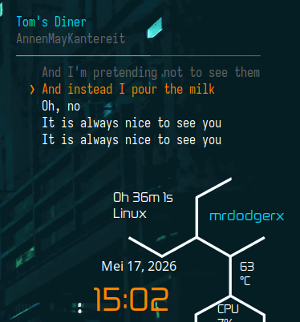

# Conky Spotify Lyrics Karaoke

Real-time synced Spotify lyrics displayed on your Conky desktop with karaoke-style highlighting. Supports dual monitors, CJK characters, and auto-start.



## Features

| Feature | Description |
|---------|-------------|
| Real-time sync | Tracks Spotify playback position via `playerctl` |
| Karaoke highlight | Current line in orange with ❯ indicator |
| Dual monitor | Separate Conky instance for each display |
| CJK support | Japanese, Chinese, Korean lyrics render correctly |
| Synced lyrics | Timestamped LRC format via LRCLIB API |
| Plain fallback | Evenly distributes lines when no timestamps exist |
| Smart matching | Matches artist name to avoid wrong lyrics |
| Progress bar | Visual indicator of track playback position |
| Cached locally | Minimizes repeated API calls |

## File Structure

```
~/.conky/
├── spotify_karaoke.py          # Main lyrics fetcher & formatter
├── conky-startup.sh            # Auto-start script (called by bspwmrc)
└── victorConky/
    ├── LyricsKaraoke           # Conky config - left monitor
    └── LyricsKaraokeRight      # Conky config - right monitor
```

### Script Architecture

```
playerctl (Spotify position)
         │
         ▼
spotify_karaoke.py
  ├── Extracts track ID, artist, title, position
  ├── Searches LRCLIB API (with artist name validation)
  ├── Parses synced LRC or plain lyrics
  ├── Matches current position to lyric line
  └── Outputs Conky-formatted text with color codes
         │
         ▼
Conky (Sarasa Mono J font)
  ├── Renders track title + artist (cyan)
  ├── Progress bar (cyan/gray)
  ├── Past lyrics (dim gray)
  ├── Current lyrics (orange, bold, ❯ prefix)
  └── Upcoming lyrics (white)
```

## Requirements

| Dependency | Minimum Version | Purpose |
|------------|----------------|---------|
| [Conky](https://github.com/brndnmtthws/conky) | 1.10+ | Desktop system monitor |
| [playerctl](https://github.com/altdesktop/playerctl) | 2.0+ | Media player control |
| [Python 3](https://python.org) | 3.8+ | Lyrics fetcher script |
| curl | Any | HTTP requests |
| jq | Any | JSON parsing (optional) |

### Recommended Fonts

| Font | Use Case | Installation |
|------|----------|-------------|
| [Sarasa Mono J](https://github.com/be5invis/Sarasa-Gothic) | CJK + Latin monospace | `yay -S ttf-sarasa-gothic` |
| [Noto Sans CJK JP](https://fonts.google.com/noto) | CJK alternative | `pacman -S noto-fonts-cjk` |
| MesloLGS NF | Nerd Font with icons | Part of Nerd Fonts |

## Installation

### 1. Install Dependencies

```bash
# Arch Linux
sudo pacman -S conky playerctl python

# Debian/Ubuntu
sudo apt install conky playerctl python3 python3-pip

# Fedora
sudo dnf install conky playerctl python3
```

### 2. Clone & Setup

```bash
git clone https://github.com/mrdodgerx/conky-lyric-spotify.git ~/.conky
```

Or copy the files manually:

```bash
mkdir -p ~/.conky/victorConky
cp spotify_karaoke.py ~/.conky/
cp LyricsKaraoke ~/.conky/victorConky/
cp LyricsKaraokeRight ~/.conky/victorConky/
cp conky-startup.sh ~/.conky/
```

### 3. Install Font

```bash
# Sarasa Mono J (recommended for CJK support)
yay -S ttf-sarasa-gothic

# Or alternatively: MesloLGS NF, Noto Sans CJK JP
```

### 4. Start Conky

```bash
# Test the lyrics script
python3 ~/.conky/spotify_karaoke.py

# Start main monitor
conky -c ~/.conky/victorConky/LyricsKaraoke -d

# Start right monitor (if dual monitor)
conky -c ~/.conky/victorConky/LyricsKaraokeRight -d
```

### 5. Auto-Start (bspwm)

The included `conky-startup.sh` handles auto-start. Add to `~/.config/bspwm/bspwmrc`:

```bash
[ -x "$HOME/.conky/conky-startup.sh" ] && "$HOME/.conky/conky-startup.sh" &
```

For other WMs, add the same line to your WM's autostart file.

## Configuration

### Conky Config (`LyricsKaraoke`)

| Setting | Value | Description |
|---------|-------|-------------|
| `alignment` | `top_right` | Screen position |
| `gap_x` | `20` | Horizontal offset |
| `gap_y` | `50` | Vertical offset |
| `minimum_width` | `400` | Minimum window width |
| `xftfont` | `Sarasa Mono J:size=12` | Display font |
| `update_interval` | `1` | Refresh every 1 second |
| `color0` | `00d9ff` | Title color (cyan) |
| `color1` | `ffffff` | Upcoming lyrics (white) |
| `color2` | `666666` | Past lyrics (dim gray) |
| `color3` | `ff8400` | Current line (orange) |

### Right Monitor

The `LyricsKaraokeRight` config uses `gap_x: -1900` to position the window on the second monitor (1920x1080 layout). Adjust this value based on your screen resolution.

### Python Script

| Setting | Default | Description |
|---------|---------|-------------|
| `TIMEOUT` | `8` seconds | API request timeout |
| `CACHE_DIR` | `~/.cache/spotify_lyrics/` | Lyrics cache location |

## How It Works

### API Flow

1. **playerctl** queries Spotify's MPRIS interface for:
   - Track ID (`mpris:trackid`)
   - Artist (`xesam:artist`)
   - Title (`xesam:title`)
   - Current position (`position`)
   - Track length (`mpris:length`)

2. **LRCLIB API** is searched using artist + title, with artist name validation to prevent wrong matches

3. If synced lyrics exist (LRC format with timestamps), they're used directly with precise line matching

4. If only plain lyrics exist, lines are evenly distributed across the song duration

5. Results are cached locally by MD5 hash of artist|title

### Artist Matching

To prevent showing lyrics from a wrong version of a song, the script validates that the returned artist name partially matches the playing artist (case-insensitive, whitespace-removed).

## Changelog

See [CHANGELOG.md](CHANGELOG.md) for version history.

## License

MIT License - see [LICENSE](LICENSE) for details.

## Acknowledgments

- [LRCLIB](https://lrclib.net) - Free synced lyrics API
- [VictorConky](https://github.com/Gictorbit) - Base Conky theme
- [Sarasa Gothic](https://github.com/be5invis/Sarasa-Gothic) - CJK font
- [playerctl](https://github.com/altdesktop/playerctl) - MPRIS controller
